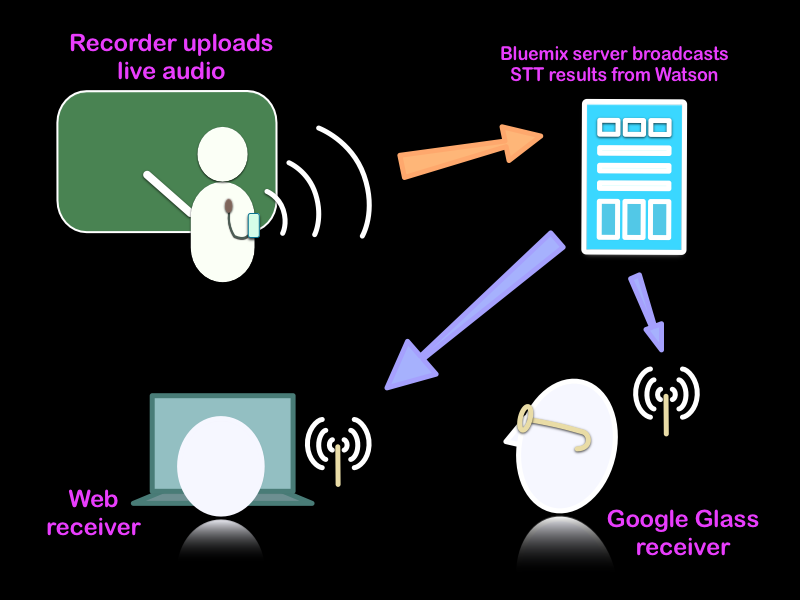

### Purpose

This bluemix project builds a live-transcription broadcasting service for use in settings 
of public gathering. In such settings, the speech recorded from the speaker is transcribed 
and broadcasted to members of the audience in nearly real time. People with special hearing 
or language needs may benefit from the visual aid provided by this service in such environments 
as lectures and conferences.

### Design
The project has three components: Server, Clients and Backbone. Each of these components will 
be described shortly.

### Backbone
This project uses the Watson Speech-To-Text (STT) service as its backbone. 

### Server
The server acts as the mediator between the clients and the STT service. Audio received from 
the client (in the recorder role) is passed on to the STT service. When transcription result 
is available from the STT service, the server broadcasts the result to all clients.

The server is also responsible for managing clients' roles. A client may be in one of the two 
roles: a recorder or a receiver. At any one time, only one client may be in the recorder role. 
The client in this role may have the exclusive privilege to submit audio for transcription. 
Other clients are required to be in the receiver role, which allow them to receive the result 
of transcription. When the recorder role is released from a client, the server may assign this 
role to another client upon request. 

The server is written in node.js and is run on bluemix. It connects to both the clients and 
the STT service via socket.io.

### Clients

A mobile client may connect to the server through a mobile device. Mobile clients may choose 
to connect as a recorder or a receiver.

A web client connects to the server through the website. Clients connected this way may only 
be receivers.

A Google Glass client may connect directly via wifi. Currently such clients may only connect 
as receiver.

### Source code

- Server: https://hub.jazz.net/project/wrstar/SpeechToText-broadcast/overview or https://github.com/RStarTec/SpeechToText-broadcast-nodejs-server
- Android client: https://github.com/RStarTec/SpeechToTextBroadcaster-Android
- Google Glass client: https://github.com/RStarTec/SpeechToTextReceiver-GoogleGlass

### TODO

1. Current support for mobile clients is limited to Android devices. An iOS client may be developed.

### Terms of Use

This project is under the Apache2 license. 
The author(s) intended this project for beneficial uses in society and would appreciate this 
wish to be respected.

### Contact

Please contact us for any feedback or suggestions. Thank you!
